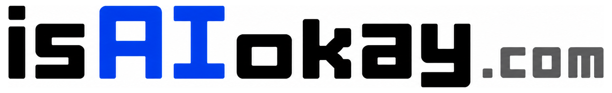

<p align="center">
  <a href="https://isaiokay.com">
    
  </a>
</p>

<p align="center">
  A community view of how AI coding models are doing in everyday development work.
</p>

<p align="center">
  <a href="https://isaiokay.com">Website</a> ·
  <a href="https://www.npmjs.com/package/@isaiokay/cli">CLI on npm</a> ·
  <a href="./docs/architecture.md">Documentation</a>
</p>

## About

Hi, I'm [Andrés](https://x.com/andfkdev). I started IsAIokay because I was tired of trying to work out which AI model was actually best for coding right now. Models change quickly, new ones appear all the time, and benchmarks do not always reflect what it feels like to use them in real development work.

My mission is to use feedback from developers working with these tools every day to build a clearer picture of the real experience across the models available. That means understanding not only whether they produce good results, but whether those results feel worth the time and usage they consume. This shared view should make it easier for all of us to choose the model that gives us the best coding experience at any given moment.

IsAIokay.com collects that feedback through short ratings and brings the recent results together by model. It is open source, so anyone can see how the project works and help improve it.

This repository contains both parts of the project:

- the [IsAIokay.com](https://isaiokay.com) website, where ratings and model trends are published;
- the optional [`isaiokay` CLI](./packages/cli), which makes it easy to leave feedback close to the coding session.

You do not need an account to browse the website. GitHub sign-in is used when submitting a rating or creating a public profile.

I originally wanted to offer X sign-in as well, but the X integration needed by the project requires paid API access. IsAIokay does not make any money, so GitHub is currently the only sign-in option.

## How ratings work

A rating is intentionally small. It records the model and asks two questions:

1. How good was the result?
2. Did the progress feel worth the usage?

The first question is about the usefulness and correctness of what the model produced. The second captures the less visible part of the experience: whether the result felt reasonable for the subscription allowance, tokens, or metered usage it took to get there.

The coding tool can be included as context, but rankings are about models rather than agents. Trends, comparisons, and recency are calculated by the service; developers do not have to fill in extra fields or write a comment.

## Using the CLI

The CLI can listen for completed sessions from supported coding tools and offer a check-in after enough meaningful use. It does not ask after every command, and it never submits a rating on its own.

Node.js 22 or newer is required.

```bash
npm install --global @isaiokay/cli
isaiokay
```

The first run signs in through GitHub, looks for coding tools installed on the machine, and offers to configure the integrations it finds. Once setup is complete, continue using commands such as `codex`, `claude`, `agent`, `opencode`, or `gemini` normally.

When a check-in is available, the model is preselected when the coding tool provides a reliable model identifier. The whole rating can be completed from the terminal, or skipped for the day.

Some useful commands:

```bash
isaiokay status             # Show authentication, integrations, and prompt state
isaiokay doctor             # Check installed integrations
isaiokay rate               # Open a rating manually
isaiokay prompt status      # Explain whether a reminder is currently eligible
isaiokay install --all      # Install detected automatic integrations
isaiokay uninstall --all    # Remove integrations installed by IsAIokay
```

To remove the CLI and its local state completely:

```bash
isaiokay uninstall --all --purge
npm uninstall --global @isaiokay/cli
```

Automatic integrations are available for Codex, Claude Code, Cursor Agent, OpenCode, Gemini CLI, GitHub Copilot CLI, Amp, and Grok Build. Aider, Muse Code, Cline, and Windsurf have alternative integration paths. The [CLI guide](./docs/cli.md) explains how each one works, along with headless setup, PowerShell support, and custom commands.

## Privacy

IsAIokay is designed to collect a rating, not a record of the work behind it. The CLI does not persist or upload prompts, responses, source code, diffs, file paths, transcripts, repository names, working directories, shell commands, or raw provider session identifiers.

Hooks only record a small local event that helps determine whether a check-in is appropriate. A rating reaches the service only after the developer reviews and submits it in the foreground.

Public profiles are optional and contain ratings only: the model, the two scores, optional coding-tool context, and submission time. See the [CLI privacy contract](./docs/cli.md#privacy-contract) and the website [Privacy Policy](https://isaiokay.com/privacy) for the full details.

## Local development

Clone the repository and prepare the local Cloudflare bindings:

```bash
git clone https://github.com/isaiokay-com/isAIOkay.git
cd isAIOkay
npm install
cp wrangler.example.jsonc wrangler.jsonc
cp .dev.vars.example .dev.vars
npm run db:migrate:local
npm run db:seed
npm run dev
```

The site will be available at [http://localhost:4321](http://localhost:4321). For local development without GitHub OAuth, add `MOCK_GITHUB_AUTH=true` to `.dev.vars`.

Common checks:

```bash
npm run typecheck
npm run lint
npm run test:all
npm run test:e2e
npm run build
npm run cli:test
```

The website is an Astro application deployed as a Cloudflare Worker. It uses React islands for interactive parts, D1 for relational data, and Better Auth with GitHub OAuth. The CLI is a separate workspace package under `packages/cli`.

More detailed setup and design notes live in [`docs`](./docs):

- [Architecture](./docs/architecture.md)
- [Cloudflare setup](./docs/cloudflare.md)
- [Deployment](./docs/deployment.md)
- [Authentication](./docs/better-auth.md)
- [Scoring](./docs/scoring.md)
- [CLI behavior](./docs/cli.md)

## Contributing

Questions, bug reports, and small improvements are welcome. Please read [CONTRIBUTING.md](./CONTRIBUTING.md) before opening a pull request. Security issues should be reported privately as described in [SECURITY.md](./SECURITY.md).

The code is available under the [MIT License](./LICENSE). Provider marks and project brand assets have separate notes in [NOTICE.md](./NOTICE.md).

For general help, email [hi@isaiokay.com](mailto:hi@isaiokay.com).
